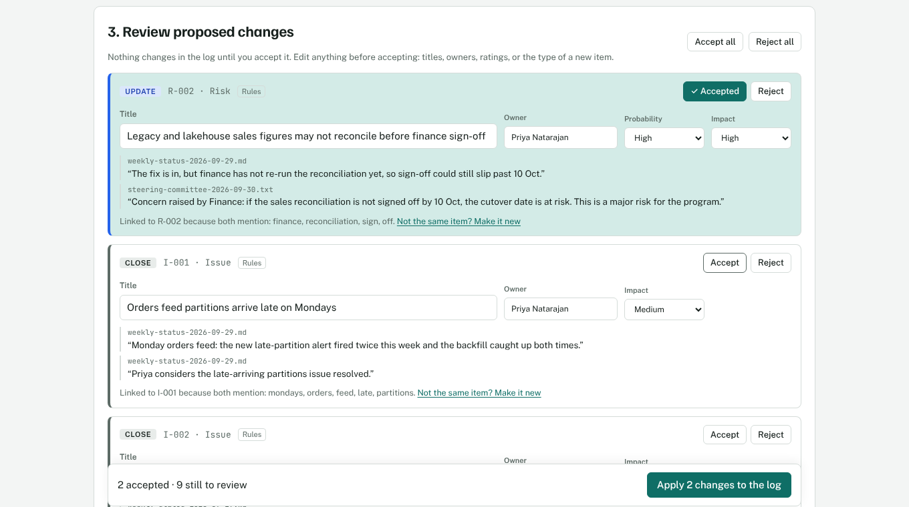
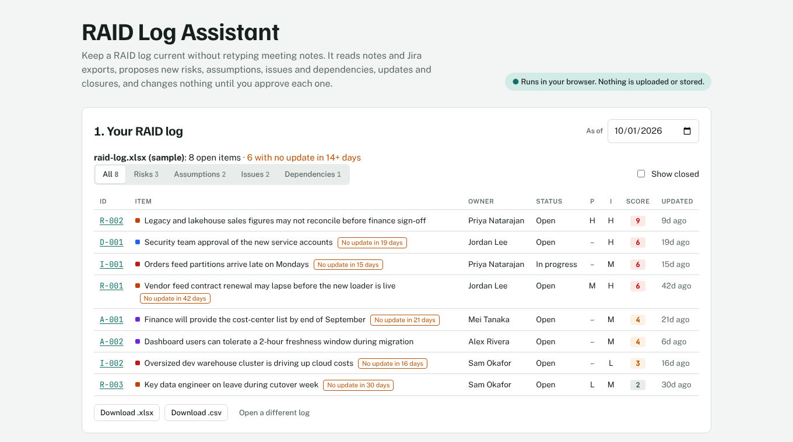
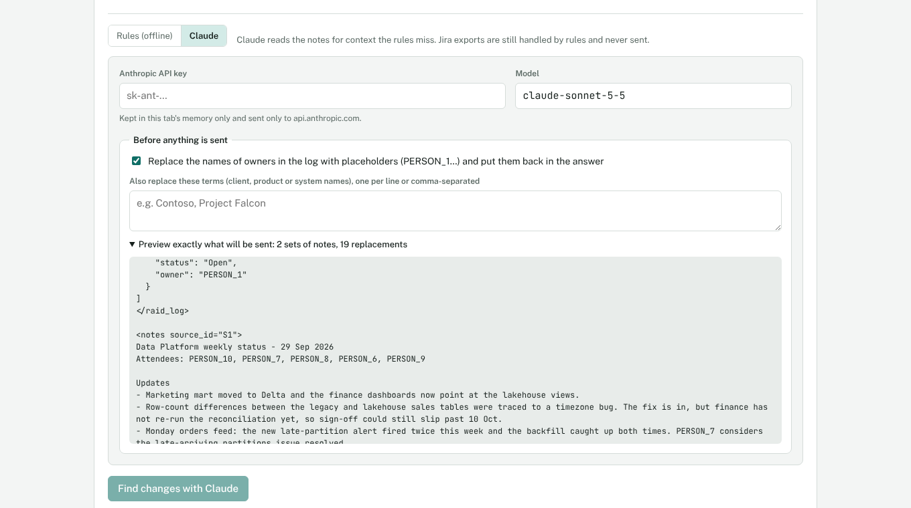

# RAID Log Assistant

Keeps a RAID log (Risks, Assumptions, Issues, Dependencies) current. It reads meeting notes and Jira exports, proposes new items, updates and closures, and changes nothing until a person approves each one. It runs entirely in the browser.

[](https://github.com/AuriumZero/raid-log-assistant/actions/workflows/ci.yml)

**[Live demo](https://auriumzero.github.io/raid-log-assistant/)**: click **Use the sample log**, then **Add sample notes and Jira export**, then **Find changes**.



## The problem

RAID logs go stale. The information is there, spread across meeting notes, status emails and Jira, but moving it into the log is manual work that loses out to everything else. A stale log is worse than none: it says a risk is under control when nobody has looked at it in six weeks.

## How it works

1. **Open your RAID log** (.xlsx or .csv). Columns are matched by name, so most templates work: `Title` or `Summary`, `Likelihood` or `Probability`, `Severity` or `Impact`, R/A/I/D codes or full type names, Low/Medium/High, 1–5 scales or percentages. It also reads the risk sheet exported by [Project Management Central](https://github.com/AuriumZero/project-management-central).
2. **Add what's new**: paste notes, upload .txt or .md files, or add a Jira issue export.
3. **Review the proposals.** Each one shows the exact words it came from, which source, and, for updates, which words linked it to the existing item. Edit anything, then accept or reject.
4. **Apply.** Accepted changes go into the log with a dated history line that quotes the source. Download the log as .xlsx or .csv, and copy a weekly digest.



## Design decisions

**A person approves every change.** The RAID log is a governance artifact, so the tool never writes to it directly. It proposes, shows its evidence, and waits. Bulk "Accept all" exists, but the default is one decision per change.

**Every proposal is traceable.** Each one carries the verbatim quote it was based on, and that quote is written into the item's history when applied. Anyone reading the log later can see where a change came from.

**Rules for structured data, AI for free text.** A Jira export has statuses, flags and sprint history, so plain rules handle it: blocked or flagged work becomes an Issue, work that has carried over two or more sprints becomes a Risk, and work already tracked in the log becomes an update. Jira data is never sent to an AI model. Meeting notes are where context matters, so that's where Claude is optional.

**Works without AI.** The offline rules engine handles the sample notes well (below), needs no API key, and nothing leaves the page. Claude is an upgrade for messier notes, not a requirement.

**Least data out, and checked on the way back.** When Claude is used:

- Only notes and the open items' ID, type, title, status and owner are sent.
- Owners' names, and any terms you list, are swapped for placeholders (`PERSON_3`, `TERM_1`) before sending and restored in the answer. Emails and links are removed.
- You can preview the exact text that will be sent.
- The answer comes back through a forced tool call with a JSON schema, and each proposal is checked: its quote must appear word for word in the notes it cites, any item it updates or closes must exist, and a "new" item that looks like an existing one is flagged. Problems are shown on the proposal rather than silently dropped.



## The rules engine

For notes (`src/lib/extract.ts`):

- **Statements**: one per bullet, one per sentence. A sentence starting with "This" or "It" stays with the one before it.
- **Type**: an explicit prefix wins (`Risk:`, `Dependency:`). Otherwise cue words: *assuming* → Assumption, *waiting on*, *depends on* → Dependency, *failed*, *broken*, *blocked* → Issue, *might*, *at risk*, *concern* → Risk. Lines starting `Decision:`, `Attendees:` or `Budget:` are skipped.
- **Matching to existing items** (`src/lib/match.ts`): words are lower-cased, trimmed to a common stem and stripped of filler words, then compared with each open item's title, description and owner. Three shared words covering 40% of the shorter text (or four covering 30%) counts as a match. The review card lists the shared words, so a wrong match is easy to spot and one click turns it into a new item.
- **Closing**: "resolved", "can be closed", "is done", "signed off", unless negated or conditional ("confirm *whether* the contract has been signed" doesn't close anything).
- **Owners**: `Owner: Name`, `Name to chase/confirm/…`, or `@name`. An existing full name isn't replaced by a first name.
- **Ratings**: *critical*, *major*, *cutover date* raise impact; *likely* raises probability; *minor*, *unlikely* lower them.

On the sample notes, the rules find 10 changes from two sets of notes: three new items, five updates (one merging mentions from both meetings), and two closures. The Jira export adds a new risk for repeatedly carried-over work, and backs up the cost-center update with the blocked ticket, so that proposal shows quotes from both sources. The tests pin all of that down (`src/lib/extract.test.ts`).

## Scoring and staleness

- **Score** is probability × impact on a 1–9 scale (Low 1, Medium 2, High 3). Issues have already happened, so they score impact × 3. Without a probability, Medium is assumed.
- **Stale** means open with no update in 14 days, measured from the **As of** date.
- **The digest** lists the five highest-scoring open items (oldest update first on a tie), everything stale, and the changes applied this session.

## Built with

- **React 19 + TypeScript (strict)**, bundled with Vite. No backend, and nothing is stored: the log lives in the page until you download it.
- **Excel in and out without a spreadsheet library**: reading unzips with [fflate](https://github.com/101arrowz/fflate) and parses the XML with the browser's DOMParser; writing reuses the small .xlsx writer from Project Management Central.
- **Vitest + Testing Library**: 32 tests covering log import across templates, level and date parsing, scoring, staleness, matching, the rules engine on the sample notes and Jira export, applying changes, masking and unmasking, the AI request, answer validation, and the main user flows.
- **GitHub Actions** runs lint, typecheck, tests and a production build on every pull request, and deploys `main` to GitHub Pages.

```
src/
  lib/
    raid.ts          the log: import, scoring, staleness, IDs
    match.ts         word-overlap similarity
    extract.ts       rules engine, merging and applying proposals
    ai.ts            Claude request, masking, answer validation
    export.ts        .xlsx, .csv and the weekly digest
    csv.ts, xlsxRead.ts, xlsxWrite.ts, jira.ts, dates.ts, table.ts
  components/        log table, review cards, Markdown renderer
public/samples/      synthetic RAID log, meeting notes and Jira export
scripts/             generates the samples
```

## Sample data

Everything in `public/samples/` is synthetic: a fictional Data Platform team, invented people and tickets. The notes are written to exercise each kind of change, plus lines that should be ignored. The Jira export is the same one the companion [Sprint Summary Generator](https://github.com/AuriumZero/sprint-summary-generator) uses.

## Run it locally

```sh
npm install
npm run dev        # http://localhost:5173/raid-log-assistant/
npm test
npm run build
```

To use the Claude option, paste an [Anthropic API key](https://console.anthropic.com/) into the page. It's held in memory for that tab only and sent only to `api.anthropic.com`.

## Roadmap

- A labelled set of notes to measure the rules engine and Claude side by side (precision and recall of proposed changes)
- Due-date extraction ("approval is now expected 8 Oct")
- Remember dismissed proposals so the same line isn't suggested twice
